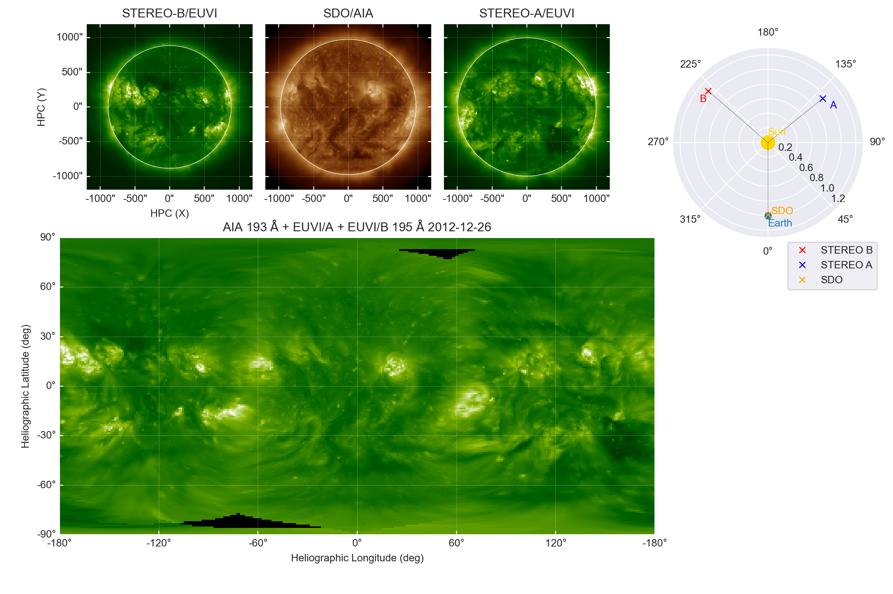

## Plotting SDO/AIA data with STEREO-A/B EUVI 195 angstrom data.

This repository holds some analysis codes for downloading, processing and plotting stereoscopic observations from SDO/AIA and STEREO-A and STEREO-B.
Some of this analysis code is based on [this SunPy example](https://docs.sunpy.org/en/stable/generated/gallery/map_transformations/reprojection_aia_euvi_mosaic.html#sphx-glr-generated-gallery-map-transformations-reprojection-aia-euvi-mosaic-py). This repository also holds some code to search and download the STEREO EUVI beacon data. Below is an example of a plot that can be generated for a particular day:

In the notebook `STEREO_AIA_3D plotting.ipynb` you can find an outlined example of how to use [sunpy](https://sunpy.org/), [astropy](https://www.astropy.org/), [reproject](https://pypi.org/project/reproject/) and [plotly](https://plotly.com/python/) to plot the full-Sun image and interact with it. Below is a gif of an example of the output. 

